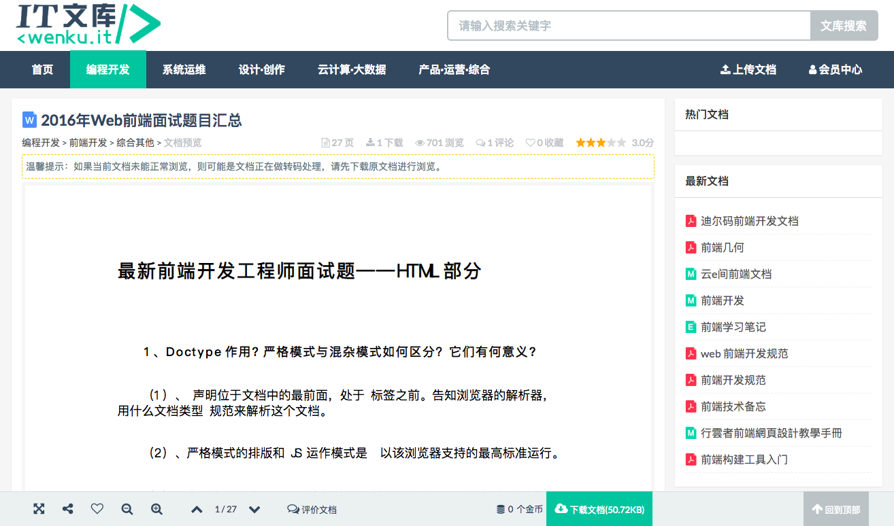
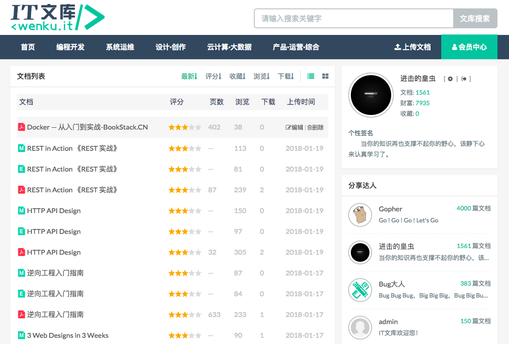
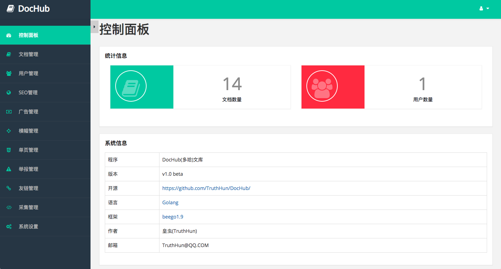
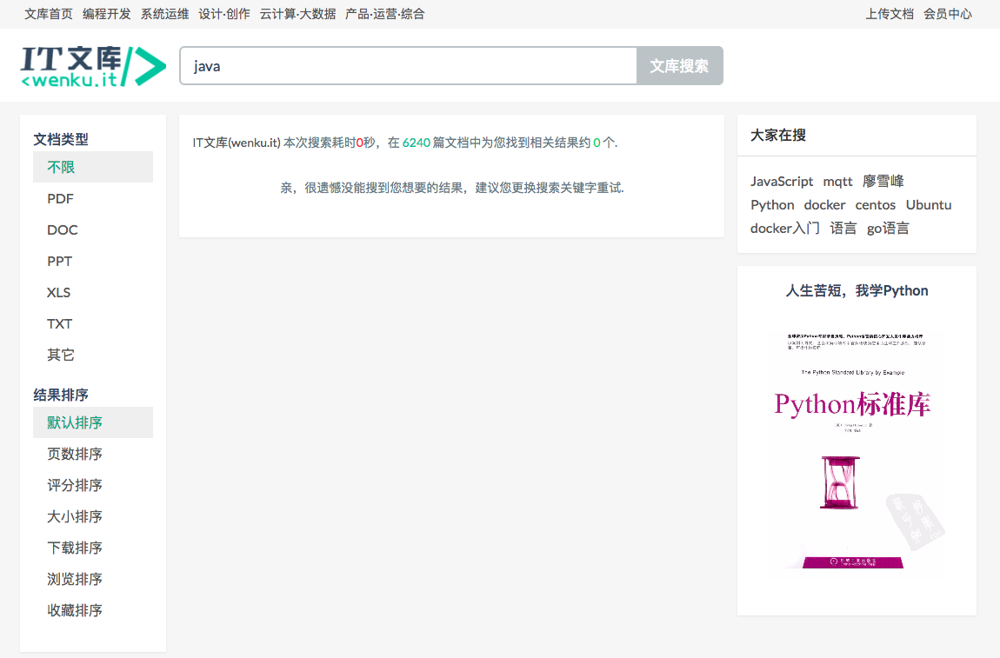
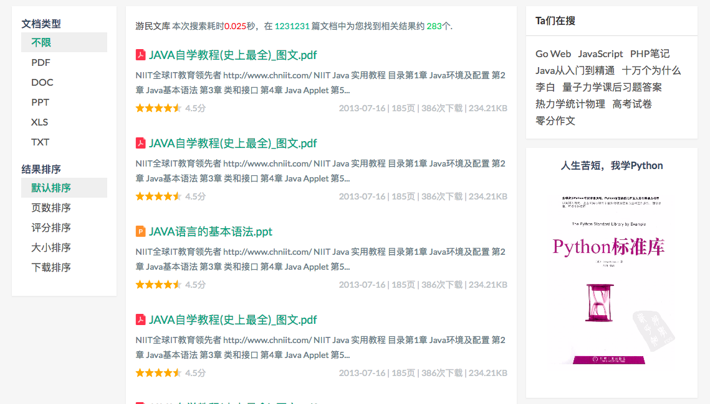

------

Thanks for [JetBrains](https://www.jetbrains.com/?from=DocHub)'s `free JetBrains Open Source license(s)`
 
[](https://www.jetbrains.com/?from=DocHub)


------

目录：
- [文库简介](#intro)
    - [程序命名](#name)
- [源码地址](#source)
- [QQ交流群](#qqgroup)
- [主要技术栈](#stack)
    - [后端](#be)
    - [前端](#fe)
    - [数据库](#db)
    - [依赖环境](#env)
        - [Libreoffice(或Openoffice)](#office)
        - [pdf2svg](#pdf2svg)
        - [calibre](#calibre)
        - [阿里云OSS](#oss)
- [功能特点](#feature)
    - [文档在线阅读](#read-svg)
    - [office文档在线阅读](#read-office)
    - [PDF文档在线阅读](#read-pdf)
    - [mobi、epub、chm文档在线阅读](#read-other)
    - [全文搜索](#es)
    - [文档采集功能【TODO】](#crawl)
    - [积分功能](#score)
    - [阅读文档水印功能](#watermark)
- [页面一览](#page)
- [使用教程](#tutorial)
- [演示站点](#demo)
- [文库模板](#tpl)
    - [PC端模板](#tpl-pc)
    - [移动端模板](#tpl-mobile)
- [关于本人](#aboutus)
- [赞助我](#support)
    - [支付宝打赏赞助](#alipay)
    - [微信打赏赞助](#wxpay)


> 重要：所有`fork`了`DocHub`项目的朋友，麻烦同时点一下`watch`，以便关注项目更新动态和跟进一些重要的Bug的修复。

> 提示：DocHub移动端模板已经放出来，[链接地址](#tpl-mobile)

> 说明(于2018-06-08)：`DocHub`项目是我学完Go语言之后的第二个独立开发的Go语言项目，项目是在2016年12月份开始开发的。当时对Go语言和Beego框架都还不怎么熟。`DocHub`项目开源出来之后，看到`star`飙升的有点快(相对个人之前的开源项目)，非常感谢大家的认可和厚爱，然后自己诚惶诚恐地认真review了一遍代码...
路由在模板页面写死了...
数据表一些数据字段也出现了冗余...
有些函数和方法封装，难以使用的一塌糊涂...
请大家给我点时间，我会把整套程序都优化好，当然，现在的版本是可用的，以后的升级版本也会是兼容升级。

> __说明(2018-06-12)__：
> DocHub演示站点：http://dochub.bookstack.cn
> 后台地址是：http://dochub.bookstack.cn/admin ；管理员账号密码均是`admin`；`您心目中的验证码`是`芝麻开门`。
> 安装和部署教程以及Docker镜像，稍后跟上。


<a name="intro"></a>
## 文库简介

还在读大学的时候，当时就想着要搭建一个类似百度文库的文库站点，实现文档在线浏览。

然而，时间一晃，好几年过去了，自己终于亲自动手开发实现了一套开源文库程序。

尽管离百度文库还有着巨大的差距，尽管可(一)能(定)会存在Bug，但是，整套程序从前端到后端到数据库再到丑陋的LOGO设计，都是自己独立完成的，满满的成就感...

<a name="name"></a>
### 程序命名
起初开发这套程序，是想自己做一个IT行业的文库站点，也就是现在的[IT文库(http://wenku.it)](http://wenku.it)，当初给文库起名就叫`IT文库`，但是决定开源出来之后，觉得这样不妥，于是起了个叫`DocHub`的名字。

毕竟，有个Git仓库管理的站点叫`GitHub`，那文档(Doc)仓库也就是文库，我干嘛不叫`DocHub`呢？

`DocHub`的中文名叫`多哈`，程序猿，写代码就要开心，开心就要`哈哈哈哈哈哈哈哈`，多`哈`...(好幼稚)

<a name="source"></a>
## 源码地址
程序源码，托管在`GitHub`和`Gitee`

- GitHub: https://github.com/truthhun/DocHub
- Gitee: https://gitee.com/truthhun/DocHub

<a name="qqgroup"></a>
## QQ交流群
为方便相互学习和交流，建了个QQ群，加群请备注`来自DocHub`

> QQ交流群：457803862(猿军团)

同时要说明的是，这个是学习交流群，如果是程序相关问题，请提交issue，再把issue链接发群里。


<a name="stack"></a>
## 主要技术栈

<a name="be"></a>
### 后端

Go语言框架[Beego](https://beego.me)

<a name="fe"></a>
### 前端

基于Bootstrap的前端框架[Flat-UI](https://github.com/designmodo/Flat-UI)

<a name="db"></a>
### 数据库

MySQL，数据存储

<a name="env"></a>
### 依赖环境

<a name="office"></a>
#### Libreoffice(或Openoffice)

用于将office文档转PDF

使用命令:
```
soffice --headless --invisible --convert-to pdf path/to/officefile --outdir path/to/outdir
```

<a name="pdf2svg"></a>
#### pdf2svg

> 注意，这个要用最新版的`pdf2svg`

pdf2svg，用于将PDF转成svg矢量图片，以供阅读。

使用命令：
```
pdf2svg <in file.pdf> <out file.svg> [<page no>]
```

<a name="calibre"></a>
#### calibre

用于将`mobi`、`chm`、`epub`等文档转成PDF，然后再将`pdf`转成`svg`

> 注意：目前`mobi`、`epub`等文档的在线阅读功能还没有实现

<a name="oss"></a>
#### 阿里云OSS
存储office文档、PDF文档以及svg等文件

> 注意：目前只支持阿里云的OSS云存储，暂时不支持其他云存储(后期我再抽时间开发和扩展其他云存储)，不支持本地化存储(现在云存储和CDN价钱比以前便宜多了)

<a name="feature"></a>
## 功能特点

<a name="read-svg"></a>
### 文档在线阅读
`DocHub`文库通过`svg`矢量图来实现文档阅读体验的，我知道的文库站点中，[新浪爱问](http://ishare.iask.sina.com.cn/)是通过`png`等图片提供文档阅读体验的。

`SVG`相比`png`、`jpeg`等图片格式有很大的优势，至少放大不会失真，而且与JPEG 和 GIF 图像比起来，svg尺寸更小，可压缩性更强，`DocHub`通过gzip，将svg文件压缩，一般情况下，能减少70%的文件大小，比如200kb的svg，gzip压缩后，只有60kb左右的大小。

使用svg，大大提升了加载速度，优化了内容的阅读体验。

<a name="read-office"></a>
#### office文档在线阅读

这个需要经过两层转化:
```
office --> pdf --> svg
```


> 之前有考虑过office文档不经过转化，然后直接在线浏览的，但是方案比较复杂，部署不容易，至少我没部署成功过...

<a name="read-pdf"></a>
#### PDF文档在线阅读

将PDF文档通过`pdf2svg`转化，提供在线阅读

> 没有使用mozila的`pdf.js`作为PDF文档阅读的实现方案，主要是我没有解决`pdf.js`分片分页加载的问题，每次都需要将整个PDF文档下载下来才能提供阅读。如果文档大的话，用户需要等待好长时间，而且也比较耗费服务器带宽资源。

<a name="read-other"></a>
#### mobi、epub、chm文档在线阅读
使用`calibre`将文档转成PDF，然后pdf再转svg。

> 目前该功能还没实现，epub、mobi等文档，现在还是暂时不能在线阅读

<a name="es"></a>
### 全文搜索
全文搜索功能，之前是使用`coreseek`开发实现了这个功能的，但是现在`coreseek`的官网都已经挂了...打算用`elasticsearch`重新实现这个功能。

<a name="crawl"></a>
### 文档采集功能【TODO】
建站初期，站点内容的填充，是一个大难点。

然而，`GitBook`、`ReadTheDoc`等站点上，就有一大堆的开源技术文档，提供`mobi`、`pdf`、`epub`离线文档下载。

初略统计了一下，`GitBook`有10多万文档，按可用文档为5万估算，每份文档，提供3种格式的下载，光从gitbook采集文档，做成文库，就有15万多的文档了。

然后，你再借助下搜索引擎，搜索`filetype:文档格式 + 搜索关键字`，如`filetype:pdf 入门教程`，你就会发现惊喜！不信，你试着赋值下面两个链接地址在浏览器打开：


```
https://cn.bing.com/search?q=filetype%3apdf+%E5%85%A5%E9%97%A8%E6%95%99%E7%A8%8B&first=11
```

```
https://www.sogou.com/web?query=filetype%3Apdf+%E5%85%A5%E9%97%A8%E6%95%99%E7%A8%8B
```

如果再爬其他文档，一年之内，单枪匹马搞个上百万文档的文库站点，应该不是个事儿。

不过，现在综合类的文库站点，如百度文库等已经做起来了，如果你打算做综合类的文库站点，还是不现实，因为空间太小了.

但是，你可以做专注于某一个方向的文库站点，比如课后习题答案文库站点、IT行业文库站点、教育类文库站点等，专注于一个行业领域方向，还是有很大成长空间的。就好比图片站点，现在很多搜索引擎都能搜索图片，但是`Pinterest`、`花瓣网`等还不是做起来了吗？

> 给你提供了程序，还给你提供了思路，给个`star`鼓励一下？

<a name="score"></a>
### 积分功能
用户签到、上传分享文档，获得积分奖励；用户下载文档，需要消耗积分

<a name="watermark"></a>
### 阅读文档水印功能
在提供阅读的svg文件上添加水印

<a name="page"></a>
### 页面一览

没有哪一个时代不是看脸的...

- 首页

> 

- 文档阅读页

>

- 用户中心

> 


- 管理后台

> 


- 搜索结果

> 

> 


<a name="tutorial"></a>
## 使用教程

当运行程序的时候，程序会自动初始化数据，默认的初始管理员账号密码均是`admin`

但是由于环境依赖安装问题，所以有必要整理一个使用教程处理，使用教程放在[书栈网(BookStack)](https://www.bookstack.cn)上，教程地址：[https://www.bookstack.cn/books/dochub](https://www.bookstack.cn/books/dochub)

<a name="demo"></a>
## 演示站点

目前还没有搭建演示站点，争取在这周内搭建出来。

不过，在这之前，你可以访问[IT文库(http://wenku.it)](http://wenku.it)看网站效果，但是由于这个站点，在进行迁移的时候，部分依赖没配置好，所以上传的office、PDF等文档，暂时不支持预览，搜索功能也用不了。

所以，请耐心等待，届时搭建好了演示站点，会把演示站点的管理员账号密码放出来，以便体验使用。

<a name="tpl"></a>
## 文库模板

`DocHub`文库的前端模板，包括PC模板和移动端模板，也会放出来。但是，模板可能跟套在程序上的有差距，毕竟在开发的时候有对页面做了一些调整。

<a name="tpl-pc"></a>
### PC端模板
- GitHub: https://github.com/truthhun/DocHubTemplate4PC
- Gitee: https://gitee.com/truthhun/DocHubTemplate4PC

<a name="tpl-mobile"></a>
### 移动端模板
- GitHub: https://github.com/truthhun/DocHubTemplate4Mobile
- Gitee: https://gitee.com/truthhun/DocHubTemplate4Mobile

<a name="aboutus"></a>
## 关于本人

2014年7月本科"毕业"踏入IT行业；Web全栈工程师；什么都懂一点，什么都不精通。

<a name="support"></a>
## 赞助我

由于整套程序都是独立一个人开发完成，限于个人经验、知识面和技术栈体系的限制，现在的程序不会是完美的，但至少，我在努力，我会争取把开源文库程序做好，缩短与成熟文库系统的差距。

所以，给出你的意见和建议，给出你的打赏与鼓励，让我知道，我不是一个人在孤独地战斗。

> 赞助的时候，麻烦备注一下你的称呼，以便公开并表示感谢

<a name="alipay"></a>
### 支付宝打赏赞助


<a name="wxpay"></a>
### 微信打赏赞助

